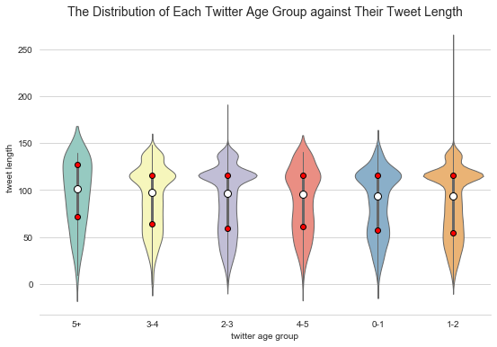

# Exploratory data analysis and visualisation

### Purpose
The purpose of this project is to investigate and visualise data using several data science tools. The statistics related to all electricity generation in Australia is explored primarily through visualisation with tools such as motion chart and linear regression. The pre-processed tweets about bushfires in Australia is also investigated and explored through the process of exploratory data analysis (EDA).

### Version
1 May 2020

### User Instructions

### Interesting Findings
- Energy dataset: As you can see from the motion chart below, the reliance on Wind increased significantly from 2009 to 2018 in South Australia, while that on Natural gas had been stagnant. On the other hand, the reliance on Natural gas continuously increased over time in Western Australia, while that on Wind fluctuated during the same time. 

&nbsp;&nbsp;&nbsp;

- Twitter dataset: Seen from the violin plot below, the interquartile range (IQR) which is marked as red dots does not vary much among twitter age groups. Regarding the median which is represented as the white dot, it is noted that the median of the group "0-2" and the group "1-2" is lower than any other group. This means that the authors who had been using Twitter less than 2 years had less tweet length, on average, compared to the authors using Twitter more than 2 years.  

&nbsp;&nbsp;&nbsp;

### Dataset
- [Australian Energy Statistics](https://www.energy.gov.au/government-priorities/energy-data/australian-energy-statistics)
- Twitter
